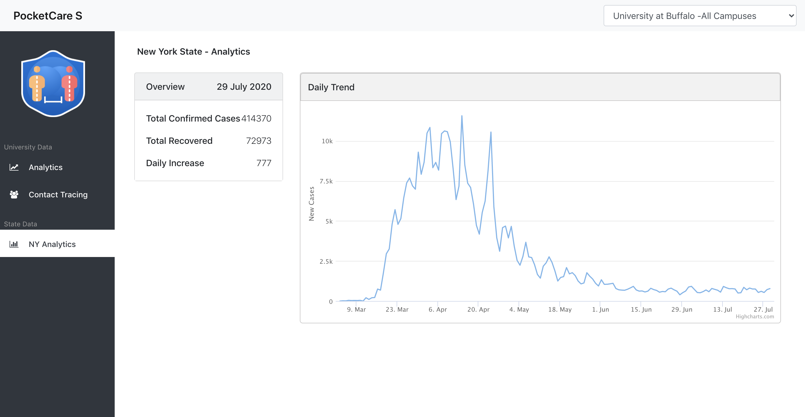

# PocketCare S - WebPortal (FrontEnd)


**Call for code submission for COVID-19 track.**

PocketCare S is a comprehensive smartphone-based solution for monitoring close encounters. It is a bluetooth low energy (BLE) based solution which enables smartphones to send and receive anonymous beacon signals. It checks the distance between a smartphone and another beacon (or smartphone running PocketCare S) to see if they are close to each other (less than 2m). If so, the smartphone records the duration of such a close encounter with another beacon. 

PocketCare S is designed to report social distance information without collecting or revealing any personally identifiable information about any specific individual.


## Contents 
1. [Demo Video](#demo-video) 
2. [The Architecture](#the-architecture)
3. [Getting Started](#getting-started)
4. [How does PocketCare S Work?](#how-does-pocketcare-s-work)
5. [Built With](#built-with)
6. [Project RoadMap](#project-roadmap)
7. [Further Readings](#further-readings)
8. [License](#license)
9. [Acknowledgments](#acknowledgements)

## Demo Video 

[](http://www.youtube.com/watch?v=JnOWwagUgxQ "PocketCare S Demo")
 
 
## The Architecture


## Getting Started  

### Prerequisites for installation on local machine

Before you begin, make sure you satisfy the following requirements in order to run the server on your local system:

1. NPM (node package manager) which can be installed from [here](https://nodejs.org/en/download/)
   
### Steps for running on local system
1. Clone the repository
2. Open the project on Visual Studio Code.
3. search for file constants.js
4. Update the Server API URL ans save here
   export const baseUrl =
  "https://pocketcares-server-app-pocketcares.mycluster-dal10-b-746843-c6bcb6f7fc0a61609dee42a1778bf377-0000.us-south.containers.appdomain.cloud";
5. On the terminal in the project directory run the commands as
    1. ```npm install```
    
    2. ```npm start```

### Steps for installation on Openshift 
1. Install the OC cli on your system using the following [link](https://mirror.openshift.com/pub/openshift-v4/clients/oc/)
2. Once installed.
3. Open the openshift console
4. Get the login command
5. 
6. Copy and paste the command in terminal at the folder where the react application source code resides.
7. On the terminal in the project directory run the commands as
    1. ```npm install```
    
    2. ```npx nodeshift --strictSSL=false --dockerImage=nodeshift/ubi8-s2i-web-app --imageTag=10.x --build.env YARN\_ENABLED=true --expose```
9. This will install the react application on the openshift and give the public url in the console.

### Web Portals Screenshots

1.Single Sign On  Note: This step is removed for the current submission as University Single Sign On cannot be provided for verification.
2.University Selction 
3.User Login 
4.Analytics DashBoard 
5.New York Analytics 
6.Contact Tracing 


## How does PocketCare S Work?

### Key Highlights (Mobile Application)

1. Close encounter data will be displayed in the mobile application after a close encounter session starts. A close encounter session starts when two people are within **2 meters** for at least **5 minutes**. 
2. The **virtual bluetooth name** changes every hour to ensure **user privacy**. 
3. Data upload to the server takes place every hour.
4. Data is stored in user's phone for a maximum of 14 days. 

### Detailed Architecture 


### Technological Advances


### Security and Privacy 


For a more detailed description, refer to [further reading](#further-readings) section. 


## Built With 

In this submission, we have used IBM’s Cloud **Red Hat OpenShift** to deploy our server (using **OpenJDK 8**), database (using **MongoDB**), the web portal (using **Node Js server**) and **IBM Push notification service** from **IBM Bluemix** in the android application of PocketCare S as a proof of concept. In the future, we will consider integrating other IBM services into the PocketCare S solution.

## Project RoadMap 

## Further Readings

You can find more information about PocketCare S here:

1. [Website](https://engineering.buffalo.edu/computer-science-engineering/pocketcares.html) 
2. [White Paper](https://docs.google.com/document/d/e/2PACX-1vT6UqA3HByzG5Di576gmz-JWzgKOFx5KLYGgJMpxcmWkOXYJ_vUFz2h1w2LnDNWI4y-xnyKhPi_s70p/pub)

## License 

This project is licensed under the Apache 2 License - see the LICENSE file for details

## Acknowledgements
Special thanks to all who helped bring the project to fruition:

Sourav Samanta, Rishabh Joshi, Jeetendra Gan, Shanelle Ileto, Aritra Paul, Dr. Peter Winkelstein, Dr. Matthew R. Bonner, Kevin Wang, Chen Yuan, Dheeraj Bhatia, Latheeshwarraj Mohanraj, Dr. Wen Dong, Dr. Tong Guan, Dr. Marina Blanton, Sasha Shapiro, Stephen Fung

And our deepest gratitude for the support of University at Buffalo.
