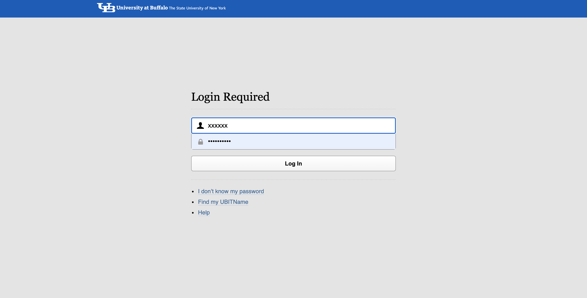
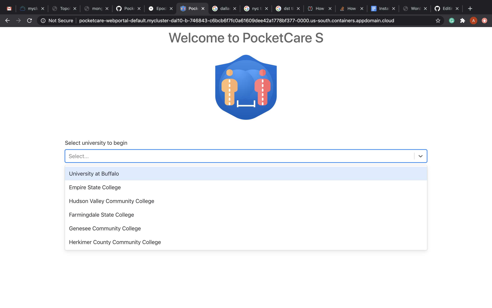
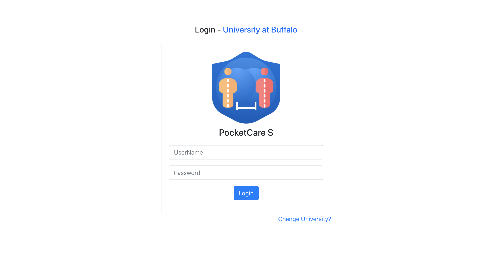
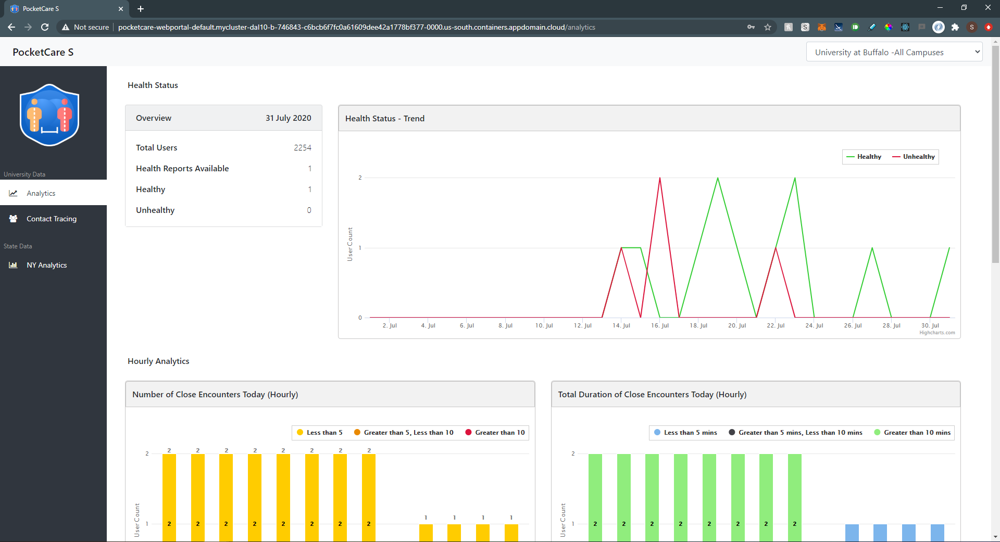
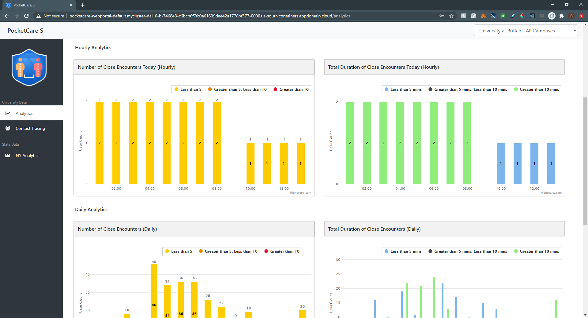
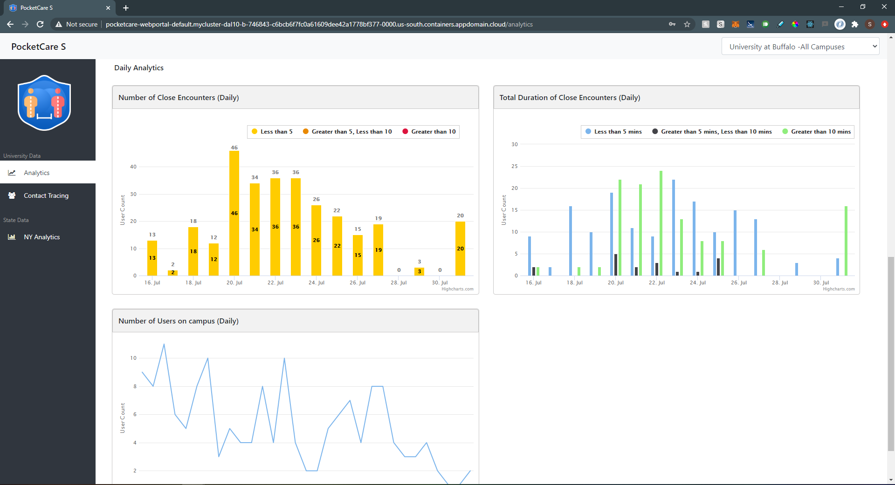
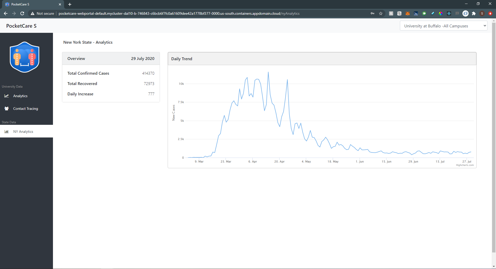
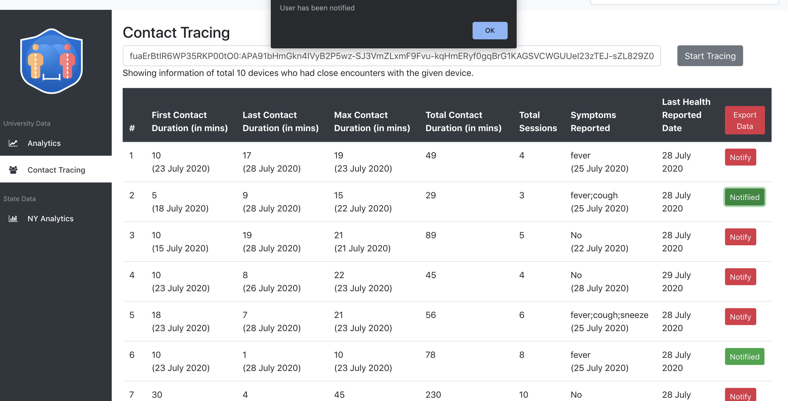

# Web Portal - Screenshots 

#### 1. Single Sign On   
Note: This step is removed for the current submission as University Single Sign On cannot be provided for verification.

#### 2. University Selection  
#### 3. User Login  
#### 4. Analytics DashBoard  

#### 5. New York Analytics  
#### 6. Contact Tracing  

How Contact Tracing works is explained [here](https://github.com/PocketCareS/WebPortal#steps-to-send-push-notifications-for-exposure-contact-tracing).
